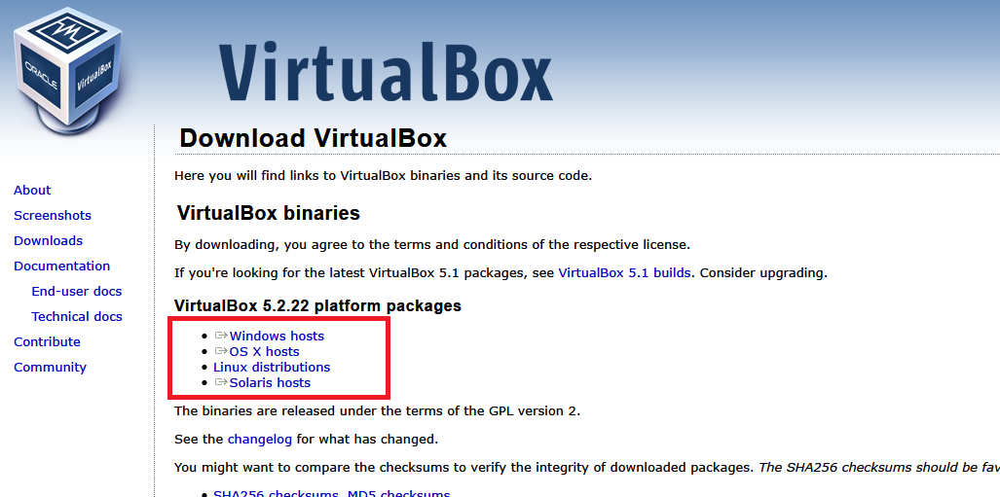
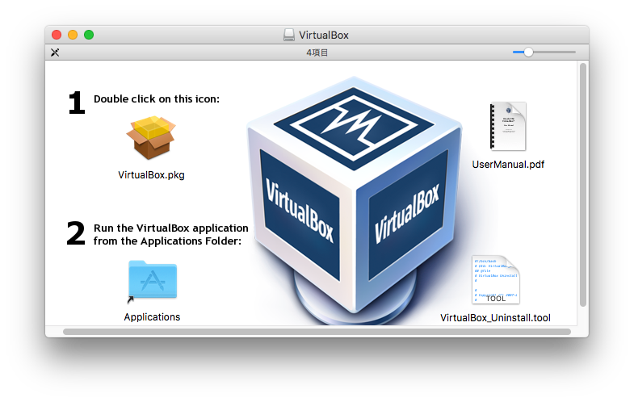
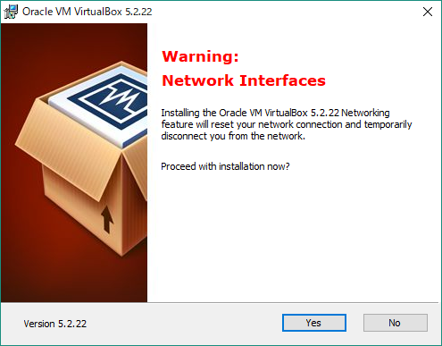
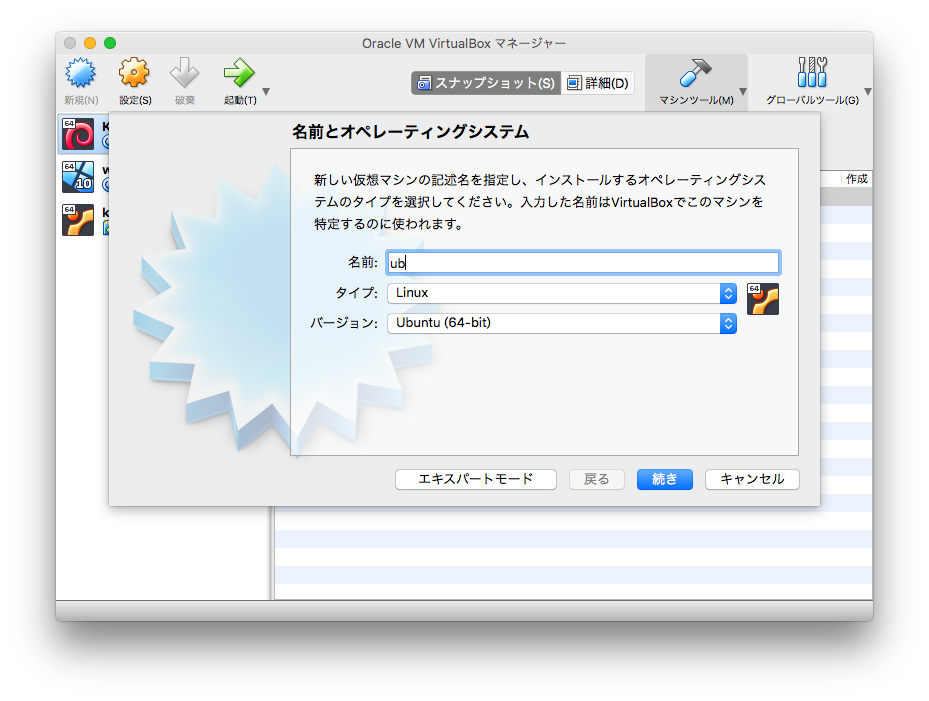
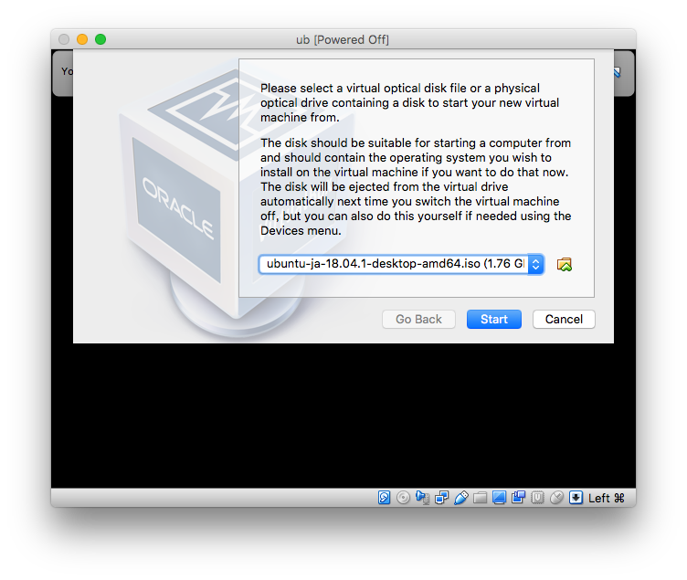
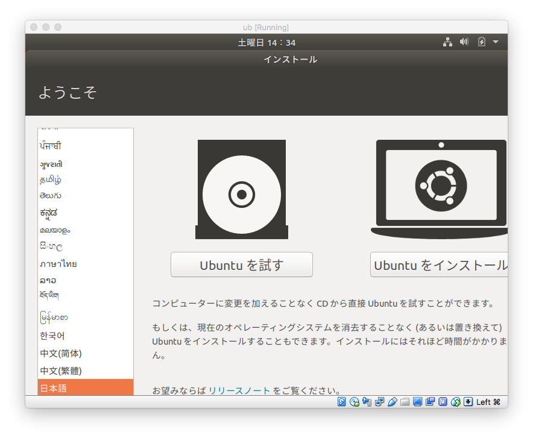
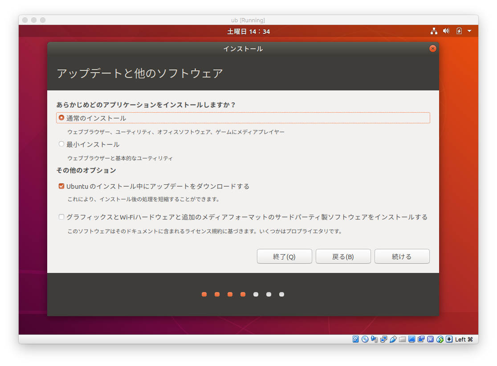
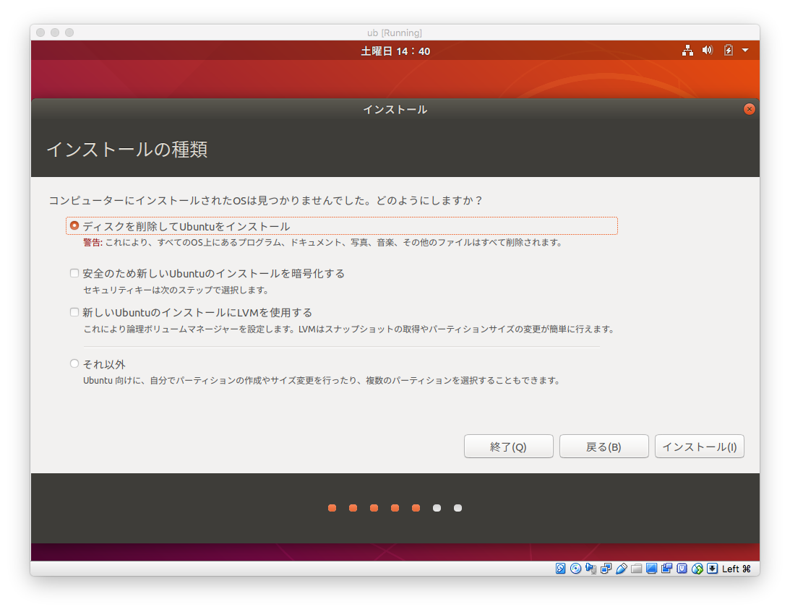
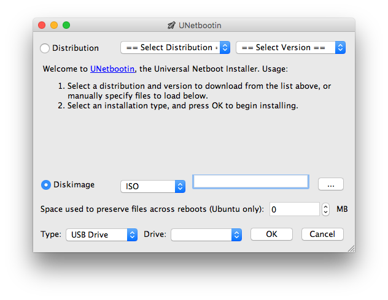

# Ubuntu利用ガイド

本ページは[Computer Science Head-Start Guide 2018 Edition](/books/cs-headstart-guide)の補足用コンテンツです。執筆時点(2018/11)でup-to-dateであるように心がけていますが、読むタイミングによっては若干現状が変わっている可能性があります。

----

本書では仮想環境上、特にVirtualBox上にインストールする方法を解説します。Ubuntuのインストーラーの画面はデュアルブート・シングルブートの場合とも共通なので、それらに必要な追加の手順であるインストールディスクの作成は別途説明します。

## ディスクイメージのダウンロード

まずはUbuntuのディスクイメージをダウンロードします。Ubuntu Japanese TeamのWebサイト [https://www.ubuntulinux.jp/](https://www.ubuntulinux.jp/) を開き、「Ubuntuのダウンロード」リンクをクリックし、「日本語Remixイメージのダウンロード」を選択します（仮想ハードディスクの日本語Remixはあったらこっちのほうが楽だったのですがUbuntu 14.04で更新が止まっていたので今回は選外）。日本語Remixイメージは日本語サポートが最初から入っていることが非常に便利です。ファイルサイズが2GB前後と非常に大きいため、従量制のネットワーク接続を使っている場合は注意が必要です。

## VirtualBoxのインストール

[https://www.virtualbox.org/](https://www.virtualbox.org/) を開き、トップにある「Download VirtualBox 5.2」(執筆時点)リンクをクリックし、ホストOSの種類に応じてWindows hosts/OS X hostsのどちらか（すでにLinux使ってたらおそらくこの手順必要ないですよね？）を選択します。

macOSの場合、ダウンロードしたdmgファイルを開くと、このような画面が出てくるので、これに従って1番のアイコンをダブルクリックし、インストーラの指示に従います。VirtualBoxの起動は以下の画像にある通り、Applicationsフォルダを開いてVirtualBoxのアイコンをダブルクリックすることでできます。

Windowsの場合、ダウンロードしたexeファイルをダブルクリックすると、インストーラーが起動します。基本的にNextとOKをクリックするだけの作業になりますが、以下のような警告画面が表示される場合があります。これは「ネットワーク関係ちょっと弄るからインターネットが瞬断するよ」と言っているので、特に問題がなければ先に進んで構いません。

## 仮想環境のセットアップ

「新規」のアイコンをクリックすることで仮想マシンを新規作成します。

- 名前とオペレーティングシステム: 名前を指定し、タイプ「Linux」、バージョン「Ubuntu (64-bit)」を指定します。
- メモリーサイズ: だいたい2048MB(1GB = 1024MB、1G = 1000Mである単位系と区別するためGiBと表記することもある)か4096MB、余裕があるなら8196MBあたりを指定します。
- ハードディスク: 「仮想ハードディスクを作成する」を選択します。
- ハードディスクのファイルタイプ: 「VDI (VirtualBox Disk Image)」を選択します。
- 物理ハードディスクにあるストレージ: 「可変サイズ」を選択します。
- ファイルの場所とサイズ: ファイル名を選択し（通常そのままでよい）、ハードディスクサイズを指定します。10GBでも十分ですが40GBくらいあると安心でしょう。

仮想マシンの準備ができたら、作成した仮想マシンを選択し「起動」をクリックします。そうしたら以下のように起動するディスクイメージを選択することを求められるので、先ほどダウンロードしたUbuntuのディスクイメージ(`ubuntu-ja-18.04.1-desktop-amd64.iso` のような名前をしています)を選択します。ファイルの位置を探すにはフォルダのアイコンをクリックします。

## 実際のインストール手順

画像はVirtualBoxでインストール手順を行った際の画像となっていますが、ここからはマシンに直接インストールする場合と共通です。

インストーラーが起動すると、このような画面が出てきます。「Ubuntuを試す」を選択すればインストールせずに試すことができますが、ここでは「Ubuntuをインストール」を選択しましょう。

ここでは「通常のインストール」を選択します。「Ubuntuのインストール中にアップデートをダウンロードする」は選択したほうがいいですが、その次のチェックボックスは任意です。マシンに直接インストールする場合あったほうがいい場合がありますが必ずしも必要ではありません。VirtualBoxの場合は無視して進めましょう。

VirtualBoxでインストール手順を行っている場合は画像のように「コンピュータにインストールされたOSは見つかりませんでした」と出てくるハズです。その場合は選択されている状態のままそのまま進めて構いません。

マシンに直接インストールする場合、すでにインストールされているOSと共存させるか、ディスクを削除してUbuntuをインストールするか、の選択肢を与えられるハズです。ここでディスクを削除するとシングルブート、インストールされているOSと共存させるとデュアルブートになりマシン起動時にOSを選ぶことができます。デュアルブートとする場合はそれぞれのOSにどれくらいディスク容量を割り当てるかを選択することになります。

この後は住んでいる地域の選択を行い(システム時刻のタイムゾーン決定のために必要です)、ログインユーザーの名前とパスワードの設定を行います。その後はファイルのコピーが行われます。ファイルのコピーが完了すると再起動を求められ、再起動時にインストールメディアを取り除きキーを押せ、と言われるので指示に従います(VirtualBoxの場合はインストールメディアの取り除きは無視して構いません)。そうしたら次に起動する際にはインストールが完了し使える状態になっているでしょう。**おめでとうございます！**

## おまけ: USB起動ディスクを作る

物理マシンにインストールする場合はインストールディスクを使ってマシンを起動する必要があり、そのためには起動ディスクを作成する必要があります。DVDメディアを作成する手もありますが、最近のパソコンにはDVDドライブがついていないこともあるので、USBメモリにディスクイメージを書き込み起動ディスクを作るのが一般的です。ここではUNetbootin [https://unetbootin.github.io/](https://unetbootin.github.io/) を使ってインストールメディアを作る方法を説明します。

UNetbootinのサイトを開き(サイトに何て書いてあるかわからない？それはそう、これ英語ですらなく、ドイツ語のサイトです…)、該当するOSのダウンロードアイコンをクリックしUNetbootinをインストールします。

インストールディスクに使用する8GB以上のUSBメモリを挿し込み、UNetbootinを起動し（Macだと「開発元が未確認のため開けません」とか、「osascriptが変更を加えようとしています。」などの画面が出てくることがあります。適宜指示に従ってください）、Diskimageを選択し、「...」ボタンをクリックしてダウンロードしたディスクイメージファイルを選択します。最後に「Type」は「USB Drive」を選択し、「Drive」は自分の挿したUSBメモリの名前を選択します。

注意事項として、ここで使用するインストールディスクになるUSBメモリは**初期化されます。**よって、**すでに重要なデータの入っているUSBメモリは使用しないでください。**幸い8GBのUSBメモリは1000円以下で容易に入手できるので、空のものを買ってきて使うのがよいでしょう。
